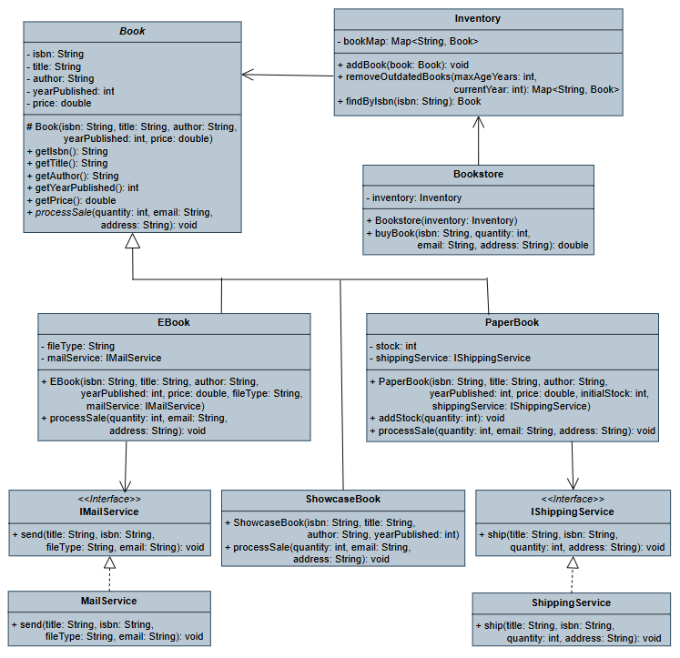

# Bookstore System Analysis and Design

### **1. Applied SOLID Principles**

#### Single Responsibility Principle
- **Definition:** A class should have only one reason to change.
- **Application:**
    - `Book`: Core data and behavior.
    - Subclasses (`PaperBook`, `EBook`, `ShowcaseBook`): Handle specific sale behaviors.
    - `Inventory`: Manages book storage.
    - `ShippingService` & `MailService`: Handle delivery logic.
    - `Bookstore`: Coordinates the sale process.

#### Open/Closed Principle
- **Definition:** A class should allow adding new features without changing its existing code.
- **Application:**  
  You can add a new book type like `AudioBook` by creating a new class that extends `Book` and overrides the `processSale()` method.  
  This means the system supports changes (new book types) **without breaking** the existing code.

#### Dependency Inversion Principle

- **Definition:** High-level modules should depend on abstractions, not concrete implementations.

- **Application:**
  - `PaperBook` relies on the `IShippingService` interface instead of a concrete `ShippingService`.
  - `EBook` depends on the `IMailService` interface instead of directly using `MailService`.
  - This design allows adding new types of shipping or mail services **without modifying any book-related code**.
  - Clean separation between book logic and delivery methods.

### **2. Applied Design Pattern**

* **Strategy Pattern:**
  The `Book` class delegates the delivery behavior to an external **strategy** object. This pattern allows defining a family of delivery algorithms and making them interchangeable without modifying the book classes themselves.

  - `ShippingService`: handles physical delivery for `PaperBook`.
  - `MailService`: handles digital delivery for `EBook`.

  These services implement interfaces (`IShippingService`, `IMailService`) and are passed into books during creation. This design makes the system **extensible**, allowing you to add new delivery methods such as `DroneDeliveryService`. You don’t need to modify the existing book classes to support them.

### **3. Choice of Data Structures**

- **Why `Map<String, Book>` in `Inventory`?**
    - Fast lookup by ISBN (O(1)).
    - Prevents duplicates, simplifies updates/removals.

- **Why `LinkedHashMap` over `HashMap`?**
    - Maintains insertion order for consistent listing/removal.

### **4. UML Class Diagram**

### **4. Output**

## Note
I noticed an unusual number of clone operations during the period allocated for the solution. This indicates the possibility that others might have used this solution without permission.
[Mohammed Ashraf](https://github.com/mashraf8/Fawry-Internship-Challenge-2.git)
